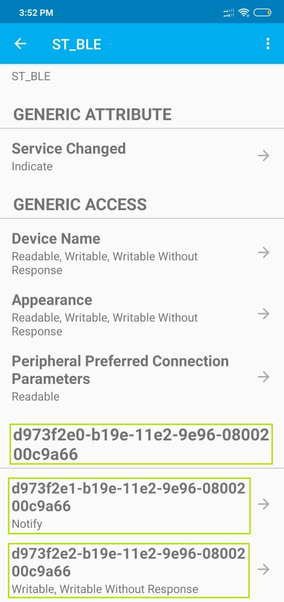
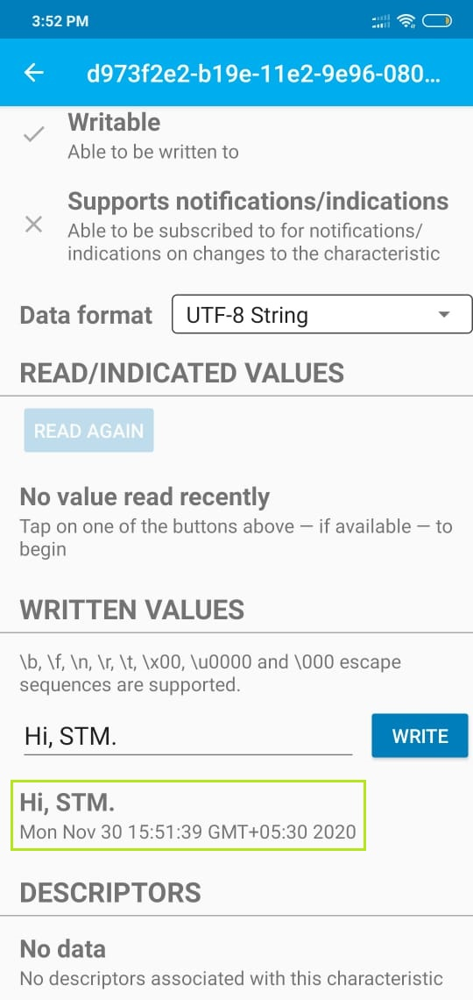

# 07_BLE_TwoWay_Comm

<table>
  <tr>
    <td></td>
    <td></td>
  </tr>
 </table>
<table>
  <tr>
    <td></td>
    <td></td>
  </tr>
 </table>
 <table>
  <tr>
    <td></td>
    <td></td>
  </tr>
 </table>

 
 
 

