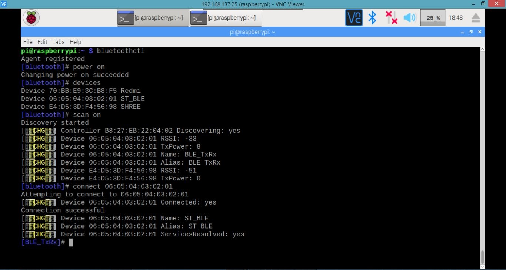
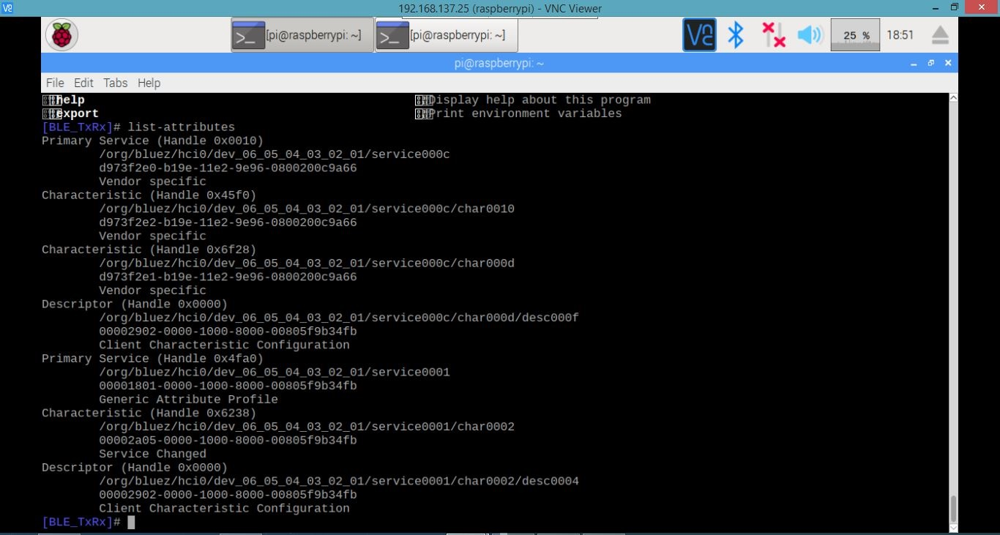
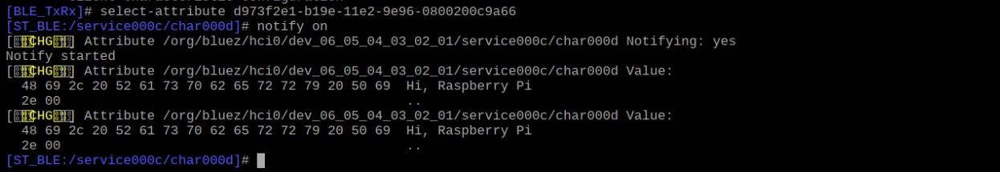
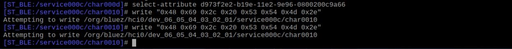
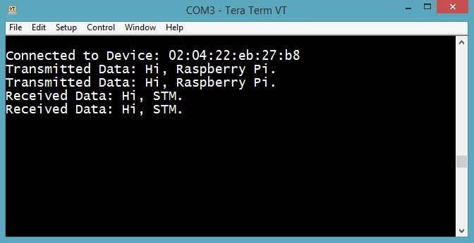

# 08_BLE_RaspberryPi_STM32_communication

<table>
  <tr>
    <td></td>
  </tr>
 </table>
<table>
  <tr>
    <td></td>
  </tr>
 </table>
<table>
  <tr>
    <td></td>
  </tr>
</table>

<table>
  <tr>
    <td></td>
  </tr>
</table>
<table>
  <tr>
    <td></td>
  </tr>
</table>

